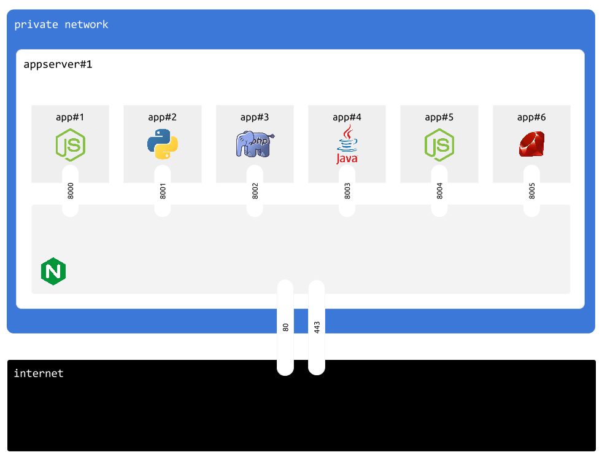

## Intro

Application server is a server type that will let us run applications inside docker containers.

Unused port is automaticaly assigned to each container to route HTTP traffic.

Nginx is listening on ports 80 and 443.

In the example below, organisation has 6 apps and 1 `appserver` instance





## Design decisions

### Docker

One `appserver` instance runs multiple apps, each app has its own docker container

Multiple `appserver` instances inside same organisation will run, the exact same set of apps


### Application state

Each application is stateless. We consider that you must NOT use your application server's disk to store app state

Instead, you can use databases, file servers and services like AWS S3

Please check guides on [mongodb](/guides/mongo3server/) and [mysql](/guides/mysql/) to understand how cmdcenter manages databases 

Stateless approcoah also helps to horizontaly scale your apps, by adding or removing `appserver` instances at will.


## Create new instance

Assuming that:

- your organisation name is: `myorg`
- public IP of your server is: `aaa.aaa.aaa.aaa`
- private IP of your server is: `bbb.bbb.bbb.bbb`


```
cmdcenter.py create instance --pubip aaa.aaa.aaa.aaa --privip bbb.bbb.bbb.bbb --desc "note" appserver --org myorg
```

Running this command will add new entry into `instances.json` file in `myorg/servers/appserver` folder


## Instances file

`instances.json` contains list of every `appserver` instance available in current organisation


```json

[
    {
        "publicIP": "aaa.aaa.aaa.aaa", 
        "description": "note", 
        "role": "default", 
        "name": "appserver_o6hbh", 
        "privateIP": "bbb.bbb.bbb.bbb"
    }
]

```

each instance has following fields:

Field         | Meaning
--------------|----
publicIP      | Public IP address of this server
privateIP     | IP address of this server on the private network
name          | unique instance name
role          | always `default`
description   | optional text to describe this instance


## Credentials file

Instances are automatically configured to use sshkeys as ssh auth mecanism.

However, users still require passwords to perform system administrator operations 


Assuming that your organisation name is: `myorg`, username and password of sudo capable user is stored in `myorg/servers/appserver/access.ini` file:


```ini
[sudouser]
username=randomsudousername
password=RaNd0mP@5SW0rD
```


## Apply configuration (1/2)


First configuration step connects as root and creates sudo capable user using `access.ini` configuration.

Usualy you only run this command once, or/and everytime you add new `appserver` instance to your organisation.


```
cmdcenter.py setup server --step 1 appserver --org myorg
```


## Apply configuration (2/2)

Second configuration step connects as sudo capable user and installs minimum viable software:

- docker
- git
- nginx
- fail2ban

It also copies configutation files


```
cmdcenter.py setup server --step 2 appserver --org myorg
```


## Show servers

You can use following command to show servers in your organisation

```bash
cmdcenter.py show servers --org myorg
```

```
Here is a list of server groups i found in "myorg" organisation:

appserver
  appserver_5davo :: default :: appserver 01
    publicIP  : aaa.aaa.aaa.aaa
    privateIP : bbb.bbb.bbb.bbb

mysql5server
  mysql5server_3mqdG :: default :: main mysql5server
    publicIP  : ccc.ccc.ccc.ccc
    privateIP : ddd.ddd.ddd.ddd

mongo3server
  mongo3server_lEdlj :: default :: main mongo3server
    publicIP  : eee.eee.eee.eee
    privateIP : fff.fff.fff.fff
```


## SSH

You can SSH to any server `appserver` instance.

Here is a command to lisy your SSH options for `myorg` organisation

```bash
cmdcenter.py ssh appserver --org myorg
```

```
USAGE: cmdcenter.py ssh SERVERGROUP USERNAME HOSTNAME

Here is a list of servers you can SSH:

  cmdcenter.py ssh appserver randomsudousername aaa.aaa.aaa.aaa --org myorg
  cmdcenter.py ssh appserver root aaa.aaa.aaa.aaa --org myorg

  cmdcenter.py ssh mysql5server randomsudousername ccc.ccc.ccc.ccc --org myorg
  cmdcenter.py ssh mysql5server root ccc.ccc.ccc.ccc --org myorg

  cmdcenter.py ssh mongo3server randomsudousername eee.eee.eee.eee --org myorg
  cmdcenter.py ssh mongo3server root eee.eee.eee.eee --org myorg
```


Then, simply pick an instance and user to SSH


```bash
cmdcenter.py ssh appserver root aaa.aaa.aaa.aaa --org myorg
```

You do not need to enter passwords, these are automatically picked up from your `access.ini` config files in combination with ssh keys.
