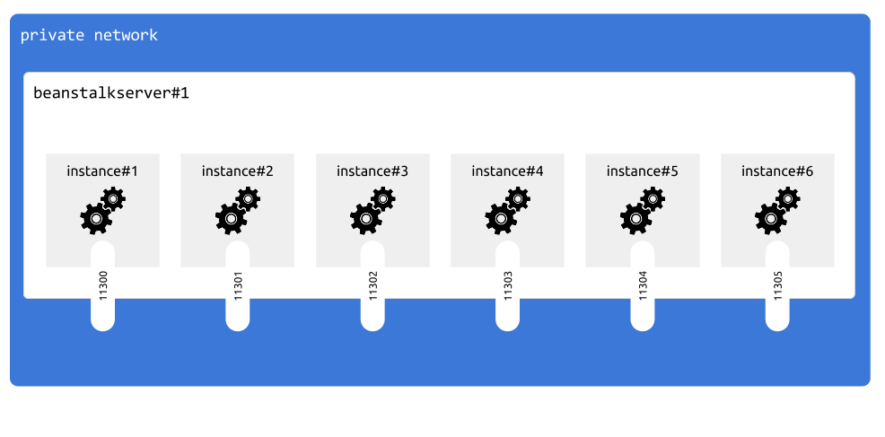

## Intro

Beanstalk server is a server type that will let us easily setup and manage [beanstalkd](http://kr.github.io/beanstalkd) daemons.

[Beanstalkd](http://kr.github.io/beanstalkd) is designed for use exclusively in trusted environments and doesn't have authentication mecanism.
For this reason beanstalkd instances only listen on private network interface.

Every `appserver` instance gets access to every beanstalk instance inside your private network.

Each time you require a beanstalkd service in one of your apps, an independent beanstalkd daemon is created on your `beanstalkserver` instance, and an available port is automatically assigned.

** IMPORTANT: One `beanstalkserver` instance runs multiple beanstalkd daemons **




## Create new instance

Assuming that:

- your organisation name is: `myorg`
- public IP of your server is: `aaa.aaa.aaa.aaa`
- private IP of your server is: `bbb.bbb.bbb.bbb`


```
cmdcenter.py create instance --pubip aaa.aaa.aaa.aaa --privip bbb.bbb.bbb.bbb --desc "note" beanstalkserver --org myorg
```

Running this command will add new entry into `instances.json` file in `myorg/servers/beanstalkserver` folder


## Instances file

`instances.json` contains list of every `beanstalkserver` instance available in current organisation

** remember that one `beanstalkserver` instance can run multiple beanstalkd daemons **


```json

[
    {
        "publicIP": "aaa.aaa.aaa.aaa", 
        "description": "note", 
        "role": "default", 
        "name": "beanstalkserver_o6hbh", 
        "privateIP": "bbb.bbb.bbb.bbb"
    }
]

```

each instance has following fields:

Field         | Meaning
--------------|----
publicIP      | Public IP address of this server
privateIP     | IP address of this server on the private network
name          | unique instance name
role          | always `default`
description   | optional text to describe this instance


## Apply configuration (1/3)


First configuration step connects as root and creates sudo capable user using `access.ini` configuration.

Usualy you only run this command once, or/and everytime you add new `beanstalkserver` instance to your organisation.


```
cmdcenter.py setup server --step 1 beanstalkserver --org myorg
```


## Apply configuration (2/3)

Second configuration step connects as sudo capable user and installs minimum viable software:

- docker
- beanstalkd (it runs in docker containers)
- fail2ban

**WARNING: this step involves downtime**
**if all you want is to add daemons, you must run deploy command below instead**


```
cmdcenter.py setup server --step 2 beanstalkserver --org myorg
```


## Apply configuration (3/3)

Last configuration step must be run everytime you create/update/remove a beanstalkd daemon.


```
cmdcenter.py setup server beanstalkserver --step deploy --org myorg
```


