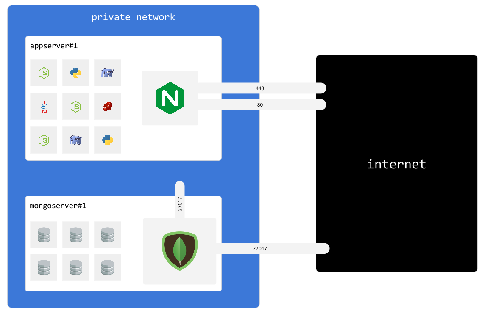

## Intro

MongoDB server is a server type that will let us easily setup and manage mongo users & databases.

Every `appserver` instance gets access to mongodb instances inside private network.

By default, `mongo3server` instances also listen on public network interface. This behaviour can be disabled.



** IMPORTANT: One `mongo3server` instance has multiple databases, but only one mongod daemon **

## Create new instance

Assuming that:

- your organisation name is: `myorg`
- public IP of your server is: `aaa.aaa.aaa.aaa`
- private IP of your server is: `bbb.bbb.bbb.bbb`


```
cmdcenter.py create instance --pubip aaa.aaa.aaa.aaa --privip bbb.bbb.bbb.bbb --desc "note" mongo3server --org myorg
```

Running this command will add new entry into `instances.json` file in `myorg/servers/mongo3server` folder


## Instances file

`instances.json` contains list of every `mongo3server` instance available in current organisation


```json

[
    {
        "publicIP": "aaa.aaa.aaa.aaa", 
        "description": "note", 
        "role": "default", 
        "name": "appserver_o6hbh", 
        "privateIP": "bbb.bbb.bbb.bbb"
    }
]

```

each instance has following fields:

Field         | Meaning
--------------|----
publicIP      | Public IP address of this server
privateIP     | IP address of this server on the private network
name          | unique instance name
role          | always `default`
description   | optional text to describe this instance


## Credentials file

Instances are automatically configured to use sshkeys as ssh auth mecanism.

However, users still require passwords to perform system administrator operations 

Assuming that your organisation name is: `myorg`, username and password of sudo capable user is stored in `myorg/servers/mongo3server/access.ini` file:

`sudouser` section defines sudo capable user

`mongoadmin` section defines mongodb super admin

`mongobackup` section defines dedicated backup user for mongodb 


```ini
[sudouser]
username=randomsudousername
password=RaNd0mP@5SW0rD

[mongoadmin]
username=randommongoadmin
password=RaNd0mP@5SW0rD

[mongobackup]
username=randommongobackup
password=RaNd0mP@5SW0rD


```


## Apply configuration (1/3)


First configuration step connects as root and creates sudo capable user using `access.ini` configuration.

Usualy you only run this command once, or/and everytime you add new `mongo3server` instance to your organisation.


```
cmdcenter.py setup server --step 1 mongo3server --org myorg
```


## Apply configuration (2/3)

Second configuration step connects as sudo capable user and installs minimum viable software:

- docker
- mongodb (it runs as docker container)
- fail2ban

It also copies configutation files.

**WARNING: this step involves downtime**
**if all you want is to add/update users, you must run deploy command below**


```
cmdcenter.py setup server --step 2 mongo3server --org myorg
```


## Apply configuration (3/3)

Last configuration step must be run everytime you create/update/remove a database user.


```
cmdcenter.py setup server mongo3server --step deploy --org myorg
```

